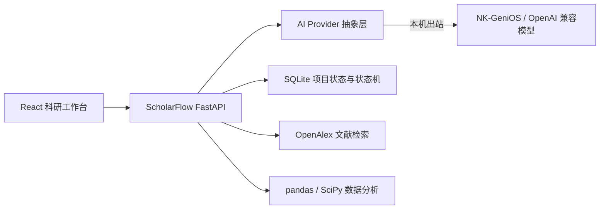

# ScholarFlow

**From Idea to Evidence. 让 AI 真正参与科研全过程。**

ScholarFlow 是面向大学生科研过程的项目工作台：把研究问题、文献、证据、假设、实验与写作草稿集中保存到同一个项目中，依据当前状态给出下一步行动，并支持接入真实大模型与南开大学 GeniOS 智能体。

系统包含两条 AI 接入路径：

- **网站内部功能**（研究规划、证据抽取、研究空白、研究设计、论文问答、写作草稿）可接入大模型，由后端 `AI_PROVIDER` 决定使用哪个服务商。
- **南开 GeniOS 智能体**作为顶层编排入口，通过 13 个 HTTP 工具读写项目状态。

未配置任何凭据时，全部功能自动回退到确定性规则，离线可用，不会中断。这是设计好的降级行为，不是故障。

各类凭据只保存在本地 `.env`，该文件已被 `.gitignore` 排除，不会进入仓库。克隆本项目后需按本文第 4 节自行配置才能启用 AI。

## 1. 当前状态

| 项目 | 状态 |
| --- | --- |
| 本地网页工作台 | 可运行，项目增删改、文献、证据、实验、分析、写作全流程可用 |
| AI 接入 | 已实现。支持 OpenAI 兼容接口、NK-GeniOS（Coze）API、本地浏览器桥接三种方式 |
| 规则回退 | 未配置凭据时自动生效，功能不中断 |
| 集成方向 | 仅本机出站：由本机调用平台或模型服务，不采用把后端暴露到公网的做法 |
| 工具接口鉴权 | 内置共享令牌作为纵深防御，设置 `GENIOS_TOOL_TOKEN` 后 `/api/genios/*` 需要 Bearer 认证 |
| 南开智能体 | 平台侧已发布 `v1.0.0`，可对话与检索，详见 [平台部署状态](genios/deployment-status.md) |
| 已验证 | 浏览器桥接方案实测通过，返回 `mode: ai:genios_browser` |
| 已知限制 | 当前南开部署的 `/api/proxy` 被统一认证网关拦截，服务端直连 API 不可行，需使用浏览器桥接 |

南开 GeniOS「ScholarFlow 科研助手」的[智能体访问入口](https://coze.nankai.edu.cn/product/llm/chat/db42qo54shhbpg8vnl40)需要南开统一身份认证。平台原生 arXiv 插件已有成功调用记录，但实测存在 HTTP 429 限流，实时检索稳定性暂不能完全保证；[演示说明](genios/demo-guide.md)提供了实时模式与明确标注的已检索材料回放模式，回放不可冒充实时检索。

## 2. 功能模块

| 模块 | 实现方式 |
| --- | --- |
| 项目工作台 | 项目 CRUD 与 SQLite 持久化；Dashboard 展示进度、研究问题与下一步行动 |
| 研究规划 | AI 优先生成研究问题、关键词、假设与任务；未连接模型时使用规则模板 |
| 文献库 | OpenAlex 实时检索、DOI 核验添加、PDF 上传、核心标记与阅读状态管理 |
| 论文阅读器 | 章节展示、阅读笔记；问答为片段检索加 AI 归纳；证据抽取为 AI 优先 |
| 证据系统 | 结构化证据矩阵、人工修订、CSV 导出；论断与证据的支持/反驳关系 |
| 研究空白与研究设计 | AI 优先分析证据覆盖与矛盾；未连接模型时使用统计规则与模板 |
| 实验管理 | Planned / Ready / Running / Completed / Failed 状态与结果记录 |
| 数据分析 | CSV / XLSX / JSON 上传；pandas 描述统计、SciPy 相关性检验、Matplotlib 图表 |
| 写作工作区 | 八个章节独立编辑；依据项目证据生成带来源标记的草稿 |
| GeniOS 工具接口 | 13 个 JSON HTTP 入口，供平台工作流调用，支持令牌鉴权 |

所有 AI 功能都会在返回体中带上 `mode` 字段：`ai:openai`、`ai:coze`、`ai:genios_browser` 表示由模型生成，`deterministic-fallback` 表示回退到规则。界面会据此提示当前结果来源。

演示项目为 **RAG for LLM Vulnerability Detection**，首次初始化数据库时自动创建。`demo/sample` 论文、证据与草稿仅用于演示，不能用于支撑正式科研结论；真实检索结果保存 `openalex` 来源标记。

## 3. 快速开始

### 环境要求

- Git、Python、Node.js 与 npm 均可从终端调用
- 推荐 Python 3.12 至 3.14、Node.js 22.12 以上或 24 LTS
- 首次安装依赖需访问 PyPI 与 npm；文献检索需访问 OpenAlex
- 默认端口：后端 `8000`，前端 `5173`

### Windows 一键启动

```powershell
git clone https://github.com/Baibai231/hauwei.git ScholarFlow
cd ScholarFlow
powershell -NoProfile -ExecutionPolicy Bypass -File .\setup.ps1
powershell -NoProfile -ExecutionPolicy Bypass -File .\start.ps1
```

已有本地项目时可直接进入项目目录，跳过 `git clone`。`setup.ps1` 创建 `.venv`、安装后端与前端依赖，并在 `.env` 不存在时由 `.env.example` 复制生成；`start.ps1` 启动两个服务。启动终端需保持开启，按 `Ctrl+C` 停止。

| 地址 | 用途 |
| --- | --- |
| <http://127.0.0.1:5173> | 首页与项目入口 |
| <http://127.0.0.1:5173/projects> | 项目列表 |
| <http://127.0.0.1:8000/docs> | 可交互 API 文档 |
| <http://127.0.0.1:8000/api/health> | 健康状态与 AI 连接状态 |

### 手动启动（跨平台）

```bash
python -m venv .venv
source .venv/bin/activate          # Windows：.venv\Scripts\Activate.ps1
python -m pip install -r backend/requirements.txt
cd frontend && npm ci
```

随后开两个终端：

```bash
# 终端 1：项目根目录
python -m uvicorn app.main:app --app-dir backend --host 127.0.0.1 --port 8000
```

```bash
# 终端 2：项目根目录
cd frontend
npm run dev -- --host 127.0.0.1
```

`npm run build` 仅生成静态资源，单独打开构建产物无法运行完整系统。

## 4. 启用 AI

三种方式任选其一，均通过项目根目录的 `.env` 配置，修改后需重启后端。完整说明见 [`genios/ai-integration.md`](genios/ai-integration.md)。

### 方案 A：OpenAI 兼容模型（推荐，跨平台最易复现）

适用于 OpenAI、DeepSeek 或本地 vLLM 等兼容接口，不依赖校园会话。

```env
AI_PROVIDER=openai
LLM_BASE_URL=https://api.openai.com/v1
LLM_API_KEY=sk-...
LLM_MODEL=gpt-4.1-mini
```

### 方案 B：NK-GeniOS（Coze）API

适用于平台已开放可外部调用的 API 渠道。需要平台侧生成个人访问令牌，并确认 API 基地址与聊天路径。

```env
AI_PROVIDER=coze
GENIOS_BASE_URL=https://coze.nankai.edu.cn/api/proxy/api/v1
GENIOS_API_KEY=<平台生成的访问令牌>
GENIOS_AGENT_ID=db3qtdd4shhas0al22qg
GENIOS_CHAT_PATH=/v3/chat
```

南开为私有化部署，聊天路径不一定与公开扣子一致。可运行探测脚本，从实际响应确认路径：

```powershell
.venv\Scripts\python.exe backend\scripts\check_genios.py
```

脚本会依次尝试几种常见接口形态并打印状态码，不会打印密钥。需要说明：当前南开部署的 `/api/proxy` 前缀会被网关重定向至统一身份认证，服务端直连暂不可行，请优先考虑方案 C。

### 方案 C：本地浏览器桥接

当平台接口受统一认证保护、无法从服务端直连时使用。后端不保存校园凭据，而是复用已登录的本地浏览器窗口。

先启动一个带调试端口的独立浏览器，不影响日常浏览器会话：

```powershell
& 'C:\Program Files (x86)\Microsoft\Edge\Application\msedge.exe' `
  --remote-debugging-port=9222 `
  --user-data-dir='C:\Users\<你的用户名>\.codex\edge-genios' `
  --no-first-run --no-default-browser-check --new-window `
  'https://coze.nankai.edu.cn/'
```

在该窗口完成统一身份认证后配置：

```env
AI_PROVIDER=genios_browser
BROWSER_CDP_URL=http://127.0.0.1:9222
BROWSER_TARGET_HOST=coze.nankai.edu.cn
BROWSER_CHAT_URL=https://coze.nankai.edu.cn/product/llm/chat/db42qo54shhbpg8vnl40
BROWSER_TIMEOUT_SECONDS=240
BROWSER_NEW_CONVERSATION=true
```

调试端口只应绑定 `127.0.0.1`，演示结束后请关闭该浏览器窗口。会话会过期，过期后自动回退到规则模式，重新登录即可恢复。

### 验证连接

重启后端后访问 <http://127.0.0.1:8000/api/health>，或打开前端 Settings 页。预期结果：

- `ai_provider` 为 `openai`、`coze` 或 `genios_browser`，`ai_configured` 为 `true`
- 浏览器桥接模式下 `browser_bridge.logged_in` 为 `true`
- AI 功能的返回体 `mode` 由 `deterministic-fallback` 变为 `ai:<provider>`

## 5. 关于后端暴露

本项目**不采用将本地后端暴露到公网的做法**。

所有 AI 能力均通过本机出站实现：由本机后端主动调用平台或模型服务，不需要平台反过来访问本机。因此完整功能不依赖入站地址、端口映射或公网隧道。后端默认只监听 `127.0.0.1:8000`。

不采用该方案的原因如下：

- 访问控制只覆盖 `/api/genios/*`，项目、文献、证据、实验、分析等常规接口没有鉴权；
- `/api/charts` 为静态目录挂载，不受令牌中间件保护；
- 数据库没有用户隔离，任何调用者看到的都是同一份数据；
- 上传接口允许 PDF 40 MB、数据文件 30 MB，可被用于消耗磁盘与 CPU；
- 隧道地址本身即凭据，一旦泄漏即可被直接调用；
- 工具调用会消耗平台或模型额度，存在成本风险。

代码中的 `GENIOS_TOOL_TOKEN` 仍然保留，作用是纵深防御：当服务部署在受控网络（例如内网服务器）时，它可以把 `/api/genios/*` 限制为持令牌方可访问。设置该令牌并不意味着后端适合公网暴露。

若将来确实需要让智能体反向调用本地工具，应优先选择内网可达或反向连接方案，而不是公网暴露，详见 [`genios/ai-integration.md`](genios/ai-integration.md)。

## 6. 配置项

后端从项目根目录 `.env` 读取配置，修改后需重启服务。`.env` 不进入版本控制。

| 变量 | 说明 |
| --- | --- |
| `AI_PROVIDER` | `auto` / `openai` / `coze` / `genios_browser` / `off`；`auto` 优先使用已配置的 GeniOS，其次 OpenAI 兼容接口 |
| `AI_TIMEOUT_SECONDS` | 单次模型调用超时，默认 120 秒 |
| `LLM_BASE_URL` / `LLM_API_KEY` / `LLM_MODEL` | OpenAI 兼容服务商配置 |
| `GENIOS_BASE_URL` / `GENIOS_API_KEY` / `GENIOS_AGENT_ID` | NK-GeniOS（Coze）配置 |
| `GENIOS_CHAT_PATH` | 聊天接口路径，默认 `/v3/chat`，需按平台实际接口确认 |
| `GENIOS_API_KEY_PARAM` | 若平台通过查询参数鉴权，填写该参数名；留空则使用 Bearer 请求头 |
| `BROWSER_CDP_URL` / `BROWSER_TARGET_HOST` / `BROWSER_CHAT_URL` | 浏览器桥接配置 |
| `BROWSER_TIMEOUT_SECONDS` / `BROWSER_NEW_CONVERSATION` | 桥接超时与是否每次新建会话 |
| `GENIOS_TOOL_TOKEN` | `/api/genios/*` 的共享访问令牌，留空则为开放状态 |
| `OPENALEX_EMAIL` | 可选，作为 OpenAlex 请求的联系邮箱 |
| `SCHOLARFLOW_DB_PATH` | 可选，覆盖 SQLite 路径；默认 `data/scholarflow.db`，父目录需存在 |
| `VITE_API_URL` | 前端可选 API 地址；需放在 `frontend/.env.local` |

密钥安全：`.env` 与 `.env.*` 均被排除，仅 `.env.example` 入库且不含真实值。推送前可运行仓库自带的检查脚本：

```powershell
.venv\Scripts\python.exe backend\scripts\check_secrets.py
```

该脚本会读取 `.env` 中的真实值并搜索所有被跟踪文件，同时检查 `.env` 是否被误提交，不会打印密钥本身。

## 7. 实现边界

- PDF 使用 pypdf 提取文本并按标题切分章节；不含 OCR，扫描版与复杂版式效果有限。Docling、PaperQA2、GPT Researcher 未集成。
- 论文问答的检索环节为关键词片段匹配，再由模型依据片段归纳，不使用向量索引或重排。
- 证据抽取、研究空白、研究设计在未连接模型时使用规则与模板，建议需人工核验。
- 写作引用是项目内部标记，不是自动核验的正式参考文献；演示内容仍需替换为真实来源。
- 实验由用户在外部执行后录入结果，当前不包含分组检验、因果推断或机器学习实验执行器。
- 未配置凭据时全部功能可用，但 OpenAlex 检索与首次依赖安装仍需联网。
- 当前没有登录与用户隔离机制，鉴权仅覆盖 `/api/genios/*`。因此项目不采用公网暴露方案，仅在本机或受控内网使用。

## 8. GeniOS 工具接口



工具定义见 [`genios/tools.json`](genios/tools.json)，所有接口使用 `POST`。这些接口用于本机或受控内网环境，当前不将其暴露到公网。

| Tool | API 路径 |
| --- | --- |
| `project_create` | `/api/genios/project/create` |
| `project_status` | `/api/genios/project/status` |
| `research_plan` | `/api/genios/research/plan` |
| `literature_search` | `/api/genios/literature/search` |
| `literature_add` | `/api/genios/literature/add` |
| `paper_parse` | `/api/genios/paper/parse` |
| `paper_ask` | `/api/genios/paper/ask` |
| `evidence_extract` | `/api/genios/evidence/extract` |
| `gap_analyze` | `/api/genios/gap/analyze` |
| `research_design` | `/api/genios/research/design` |
| `data_analyze` | `/api/genios/data/analyze` |
| `writing_draft` | `/api/genios/writing/draft` |
| `project_next_action` | `/api/genios/project/next-action` |

调用示例：

```powershell
Invoke-RestMethod `
  -Uri 'http://127.0.0.1:8000/api/genios/project/next-action' `
  -Method Post -ContentType 'application/json' `
  -Body '{"project_id":1}'
```

若设置了 `GENIOS_TOOL_TOKEN`，则需补充请求头 `-Headers @{ Authorization = 'Bearer <工具令牌>' }`。

通常返回 `{"ok": true, "data": ...}`，GeniOS 入口额外包含 `tool` 字段。`paper_parse` 接收 PDF 的 Base64 字符串，`data_analyze` 接收 JSON `rows` 或 Base64 文件。调用时需处理 HTTP 状态码与 `error` / `detail` 字段。

## 9. 仓库结构

```text
ScholarFlow/
├── backend/
│   ├── app/                    # API、SQLite、状态机、AI Provider 与浏览器桥接
│   ├── scripts/                # check_genios.py、check_secrets.py
│   ├── tests/                  # API 与流程测试
│   └── requirements.txt
├── frontend/
│   ├── src/                    # React + TypeScript 页面
│   └── package-lock.json       # 前端依赖锁文件，必须提交
├── genios/
│   ├── tools.json              # 13 个 GeniOS 工具定义
│   ├── ai-integration.md       # AI 接入完整说明
│   ├── deployment-status.md    # 平台部署状态
│   ├── agent-prompt.md         # 智能体提示词
│   └── acceptance-tests.md     # 平台验收记录
├── data/                       # 本地数据库、上传文件与图表（不提交）
├── vendor/README.md            # 第三方集成说明
├── .github/workflows/ci.yml    # 后端测试与前端构建
├── .env.example                # 配置模板（不含真实密钥）
├── setup.ps1 / start.ps1
└── README.md
```

演示 seed 位于 [`backend/app/database.py`](backend/app/database.py)，本地数据库不需要提交。备份研究数据时请先停止服务，再复制 `data/` 目录；不要把含论文全文与个人数据的数据库推入公开仓库。

## 10. 验证与持续集成

```powershell
Push-Location backend
try { ..\.venv\Scripts\python.exe -m pytest -q } finally { Pop-Location }
Push-Location frontend
try { npm ci; npm run build } finally { Pop-Location }
```

后端测试需从 `backend` 目录运行。测试通过 `AI_PROVIDER=off` 强制离线，覆盖项目 CRUD、状态推进、文献与证据/论断关联、数据分析与 GeniOS 路由声明，不等同于真实平台联调，也不测试 OpenAlex 连通性。

GitHub Actions 在 push 与 pull request 时运行后端测试（Linux Python 3.12、Windows Python 3.14）与前端构建（Node 24）。

## 11. 常见问题

- **AI 显示未连接：** 检查 `.env` 是否存在、`AI_PROVIDER` 是否与所填凭据对应，并确认已重启后端；访问 `/api/health` 查看 `ai_provider` 与 `ai_configured`。
- **浏览器桥接显示未登录：** 确认带 `--remote-debugging-port=9222` 的浏览器窗口仍开着并已完成统一身份认证；会话过期需重新登录。
- **为什么不把后端放到公网：** 访问控制只覆盖 `/api/genios/*`，常规接口与 `/api/charts` 静态目录没有鉴权，数据库也没有用户隔离。当前集成方向是本机出站，不需要入站可达，详见第 5 节。
- **端口被占用：** 检查 `8000` 与 `5173`；Vite 可能自动切换端口，实际地址以终端输出为准，换端口后需同步检查后端 CORS 配置。
- **PDF 无文本：** 当前解析器不执行 OCR，请使用可选择文本的 PDF。
- **`.xls` 无法读取：** 默认依赖支持 `.xlsx`，旧版 `.xls` 需额外引擎，建议先转换为 `.xlsx`。
- **推送被拒绝：** 先 `git fetch origin` 查看双方提交，再选择 rebase 或 merge；不要强制推送覆盖远端历史。
- **误提交依赖或数据：** `.gitignore` 已排除 `.venv`、`node_modules`、`dist`、数据库、上传文件、图表与 `.env`，仅保留 `.env.example`、源码、测试与锁文件。

## 12. 第三方与许可

运行依赖以 package 或 API 形式使用，未复制第三方仓库源码。依赖策略见 [`vendor/README.md`](vendor/README.md)，各依赖遵循其自身许可证。

本仓库目前**尚未选择项目许可证**。公开可见不等于已授予开源使用、修改和分发授权；许可证需由项目所有者决定。
