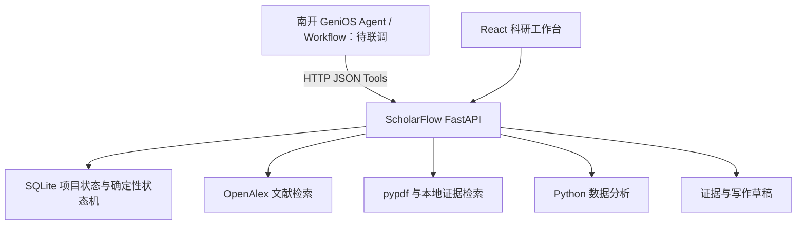

# ScholarFlow

**From Idea to Evidence. 让 AI 真正参与科研全过程。**

ScholarFlow 是面向大学生科研过程的项目工作台原型：把研究问题、论文、证据、假设、实验与写作草稿保存到同一个项目中，并根据当前状态给出下一步行动。项目以**南开大学 GeniOS Agent** 为目标编排入口，本地 FastAPI 服务提供科研状态与 HTTP 工具能力。

目前可在无 API Key 的本地演示模式下运行。GeniOS 平台连接尚未联调，配置环境变量不等于已完成平台接入。

## 当前功能

| 模块 | 当前实现 |
| --- | --- |
| 项目工作台 | 项目 CRUD、SQLite 持久化；Dashboard 展示流程进度、研究问题与下一步行动 |
| Research Planner | 规则模板生成研究问题、关键词、假设和任务；问题可在页面修改并保存 |
| 文献库 | OpenAlex 实时关键词检索、DOI 添加入口、PDF 上传、核心论文和阅读状态管理、删除 |
| Paper Reader | 展示提取的章节与文本；关键词片段检索问答；阅读笔记；结构化证据提取 |
| Evidence | 证据矩阵、人工修订、CSV 导出；Claim 与证据及论文的支持/反驳关系展示 |
| Gap 与研究设计 | 根据证据数量、置信度等生成规则化建议；创建基线与方法对照实验 |
| 实验管理 | Planned / Ready / Running / Completed / Failed 状态；手动记录实验信息和结果 |
| 数据分析 | 上传 CSV / XLSX / JSON；pandas 描述统计、缺失值统计、SciPy 相关性检验和 Matplotlib 分布图 |
| 写作工作区 | 八个论文章节独立编辑保存；使用现有证据生成带 Paper / Evidence 标记的片段 |
| GeniOS 工具接口 | 13 个 JSON HTTP 入口和集中工具定义，供平台工作流配置与联调 |

演示项目为 **RAG for LLM Vulnerability Detection**，首次初始化数据库时自动创建。`demo/sample` 论文、证据、数值和草稿仅用于演示交互，不能用于支撑正式科研结论。真实检索结果保存 `openalex` 来源标记。

## 快速开始

### 环境

- Git、Python、Node.js 与 npm 均需可从终端调用。
- 推荐 Python 3.12–3.14、Node.js 22.12+ 或 24 LTS；本地已在 Python 3.14 / Node.js 24 / Windows 上运行验证。
- 首次安装需要访问 PyPI 和 npm；在线文献检索需要访问 OpenAlex。
- 默认端口为后端 `8000`、前端 `5173`。当前版本面向本机演示。

### Windows 一键启动

```powershell
git clone https://github.com/Baibai231/hauwei.git ScholarFlow
cd ScholarFlow
powershell -NoProfile -ExecutionPolicy Bypass -File .\setup.ps1
powershell -NoProfile -ExecutionPolicy Bypass -File .\start.ps1
```

已有本地项目时直接进入项目根目录，跳过 `git clone`。`setup.ps1` 会创建 `.venv`、安装后端依赖和前端锁定依赖，并在 `.env` 不存在时复制 `.env.example`；`start.ps1` 会启动两个服务。保持启动终端打开，按 `Ctrl+C` 停止。

| 地址 | 用途 |
| --- | --- |
| <http://127.0.0.1:5173> | Landing 与项目入口 |
| <http://127.0.0.1:5173/projects> | 项目列表 |
| <http://127.0.0.1:8000/docs> | 可交互 API 文档 |
| <http://127.0.0.1:8000/openapi.json> | OpenAPI 定义 |
| <http://127.0.0.1:8000/api/health> | 健康状态 |

### 分别启动与跨平台开发

在项目根目录安装依赖：

```bash
python -m venv .venv
# macOS / Linux
source .venv/bin/activate
python -m pip install -r backend/requirements.txt
cd frontend
npm ci
```

Windows 可使用 `.venv\Scripts\Activate.ps1` 激活虚拟环境。随后在两个终端分别运行：

```bash
# 终端 1：项目根目录，已激活虚拟环境
python -m uvicorn app.main:app --app-dir backend --host 127.0.0.1 --port 8000
```

```bash
# 终端 2：项目根目录
cd frontend
npm run dev -- --host 127.0.0.1
```

前端开发服务将 `/api` 转发到本机 `8000` 端口。`npm run build` 只生成静态资源；当前仓库没有生产环境部署脚本，单独打开 `dist/index.html` 不能运行完整系统。

## 配置与实现边界

后端从项目根目录 `.env` 读取配置。修改后需要重启服务；`.env` 不进入版本控制。

| 变量 | 说明 |
| --- | --- |
| `OPENALEX_EMAIL` | 可选，作为 OpenAlex 请求的联系邮箱 |
| `LLM_BASE_URL` / `LLM_API_KEY` / `LLM_MODEL` | OpenAI-compatible Provider 封装的配置；当前业务接口尚未调用该封装，填写 Key 不会自动把规则模式切换成模型推理 |
| `GENIOS_BASE_URL` / `GENIOS_API_KEY` / `GENIOS_AGENT_ID` | 预留的平台连接配置，当前没有消费这些变量的 GeniOS SDK/客户端 |
| `SCHOLARFLOW_DB_PATH` | 可选，覆盖 SQLite 路径；默认 `data/scholarflow.db`，父目录需存在 |
| `VITE_API_URL` | 前端可选 API 地址；需放在 `frontend/.env.local` 或通过进程环境传入，Vite 不会自动读取项目根目录 `.env` |

当前版本还有以下明确边界：

- PDF 使用 **pypdf** 提取文本并按标题拆分章节；扫描版 PDF 没有 OCR，复杂版式提取效果受原文件影响。Docling、PaperQA2、GPT Researcher 尚未集成。
- 论文问答是关键词片段检索，证据提取是规则匹配；没有向量索引或模型生成回答。Gap 与研究设计使用模板，建议需要人工核验。
- 写作引用是项目内部的 Paper / Evidence 标记，不是自动核验过的正式参考文献；demo/sample 内容仍需替换为真实来源。
- 实验由用户在外部执行后录入结果；当前分析不包含完整的分组检验、因果推断或机器学习实验执行器。
- 无 API Key 可使用本地功能，但 OpenAlex 搜索和首次依赖安装仍需联网。页面在线字体不可用时会使用系统字体。
- 当前没有登录、用户隔离或 API 鉴权。公网部署前需要补齐访问控制；本机演示优先使用 `127.0.0.1`。

## GeniOS 工具接入



工具定义见 [`genios/tools.json`](genios/tools.json)，所有接口使用 `POST`。目标地址应指向 **GeniOS 运行环境能够访问的 ScholarFlow 后端地址**；远程 GeniOS 无法直接访问你电脑的 `127.0.0.1`。

| Tool | API 路径 |
| --- | --- |
| `project_create` | `/api/genios/project/create` |
| `project_status` | `/api/genios/project/status` |
| `research_plan` | `/api/genios/research/plan` |
| `literature_search` | `/api/genios/literature/search` |
| `literature_add` | `/api/genios/literature/add` |
| `paper_parse` | `/api/genios/paper/parse` |
| `paper_ask` | `/api/genios/paper/ask` |
| `evidence_extract` | `/api/genios/evidence/extract` |
| `gap_analyze` | `/api/genios/gap/analyze` |
| `research_design` | `/api/genios/research/design` |
| `data_analyze` | `/api/genios/data/analyze` |
| `writing_draft` | `/api/genios/writing/draft` |
| `project_next_action` | `/api/genios/project/next-action` |

调用示例（项目 ID 取自项目列表）：

```powershell
Invoke-RestMethod `
  -Uri 'http://127.0.0.1:8000/api/genios/project/next-action' `
  -Method Post -ContentType 'application/json' `
  -Body '{"project_id":1}'
```

通常返回 `{"ok": true, "data": ...}`，GeniOS 入口还包含 `tool` 字段。`paper_parse` 接收 PDF 的 Base64 字符串，`data_analyze` 接收 JSON `rows` 或 Base64 文件。接入时还需处理 HTTP 状态码和 `error` / `detail`；OpenAlex 网络失败可能通过 `data.error` 返回。工具文件使用共享 `$defs` / `$ref`，若平台仅接受独立 schema，需要在导入时展开引用。

当前 `output_schema` 仅定义通用响应信封，具体业务字段以实际 API 响应为准。获取 GeniOS 权限后仍需完成平台侧地址、认证、schema 和工作流映射的联调。

## 仓库结构

```text
ScholarFlow/
├── backend/
│   ├── app/                 # API、SQLite、状态机、科研工具与 Provider 封装
│   ├── tests/               # API 与流程测试
│   └── requirements.txt
├── frontend/
│   ├── src/                 # React + TypeScript 页面
│   └── package-lock.json    # 前端依赖锁文件，必须提交
├── genios/tools.json        # GeniOS 工具定义
├── data/                    # 本地数据库、上传文件和图表（不提交）
├── vendor/README.md         # 第三方集成说明
├── .github/workflows/ci.yml # 后端测试与前端构建
├── .env.example             # 无密钥配置示例
├── setup.ps1
└── start.ps1
```

演示 seed 位于 [`backend/app/database.py`](backend/app/database.py)，不需要提交本地数据库。备份个人研究数据时，请先停止服务，再复制 `data/` 到个人备份位置；不要把含论文全文和用户数据的数据库推入公开仓库。

## 验证与持续集成

Windows 下在项目根目录执行：

```powershell
Push-Location backend
try { ..\.venv\Scripts\python.exe -m pytest -q } finally { Pop-Location }
Push-Location frontend
try { npm ci; npm run build } finally { Pop-Location }
```

后端测试需从 `backend` 目录运行，确保 `app` 可导入。测试覆盖项目 CRUD、规划后的状态推进、文献与证据/Claim 关联、数据分析、GeniOS 路由声明。它们不等同于真实 GeniOS 集成测试，也不测试在线 OpenAlex 的可用性。

GitHub Actions 在 push 和 pull request 时运行后端测试及前端构建。前端使用 `npm ci` 安装锁文件版本；后端暂使用 `requirements.txt` 的版本范围，尚未提供完整传递依赖锁。

## 提交与常见问题

首次克隆会自动关联 `origin`。后续提交前检查：

```powershell
git status --short
git diff
git add README.md  # 按本次修改选择文件
git diff --cached --check
git diff --cached --stat
git commit -m "docs: update project documentation"
git push
```

- **误提交依赖或数据：** `.gitignore` 排除 `.venv`、`node_modules`、`dist`、数据库及其日志、上传论文、图表、缓存和 `.env`；保留 `.env.example`、源码、测试、目录占位文件与锁文件。
- **Windows 换行：** `.gitattributes` 统一仓库文本为 LF，PowerShell 工作区文件使用 CRLF，减少跨平台无意义差异。
- **推送被拒绝：** 先 `git fetch origin` 并查看双方提交；整理工作区后再选择 rebase 或 merge。不要用强制推送覆盖远端历史。HTTPS 认证使用 Git Credential Manager / GitHub 授权，不把 Token 写入 remote URL 或文件。
- **PowerShell 禁止脚本：** 使用上文带 `-ExecutionPolicy Bypass` 的单次启动命令，无需修改系统全局执行策略。
- **安装失败但脚本继续：** 安装脚本检查外部命令退出码，失败会立即停止。网络或权限恢复后可重新执行。
- **页面加载失败或端口占用：** 检查 `8000` 与 `5173` 是否被已有服务占用，确认后端健康接口可访问。Vite 遇到占用可能切换端口，实际地址以终端输出为准；换端口需同步检查后端 CORS 配置。
- **PDF 无文本：** 当前解析器不执行 OCR，使用可选择文本的 PDF。
- **`.xls` 无法读取：** 默认依赖包含 `openpyxl`，支持 `.xlsx`；旧版 `.xls` 还需要额外引擎，建议先转换为 `.xlsx`。

## 第三方与许可

运行依赖以 package / API 形式使用，未复制第三方仓库源码。依赖策略见 [`vendor/README.md`](vendor/README.md)，各依赖遵循其自身许可证。

本仓库目前**尚未选择项目许可证**。公开可见不等于已授予开源使用、修改和分发授权；许可证需由项目所有者决定。
